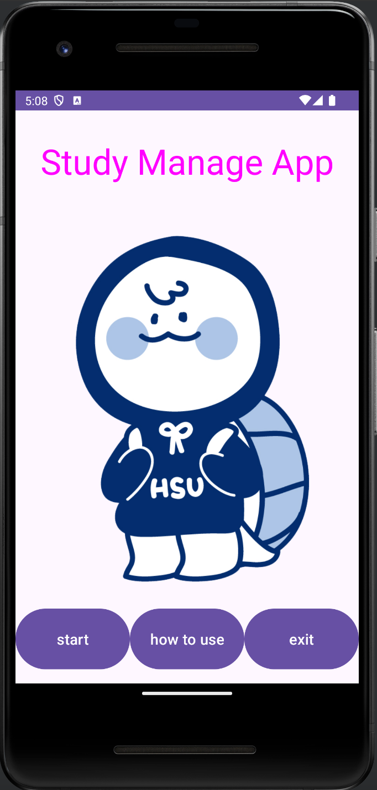
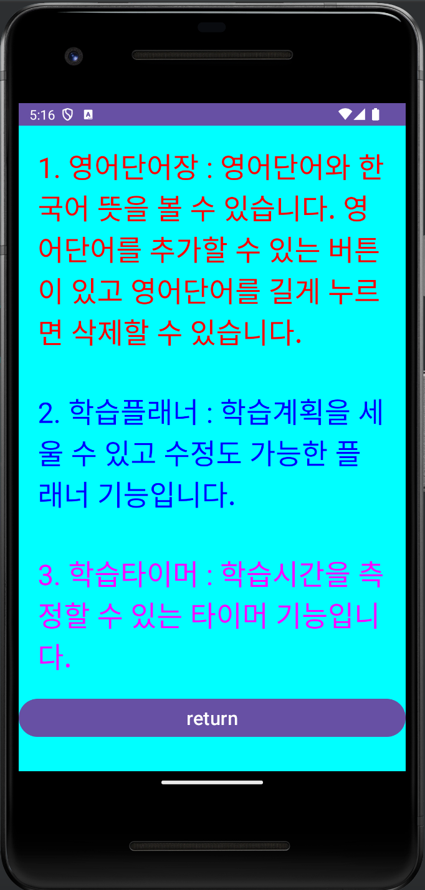

# Final-Project

### 학습 관리 안드로이드 어플리케이션

#### 1. 프로젝트에 관하여
  사용자의 학습을 보조해주는 어플리케이션이다.
#### 2. 프로젝트 기능
- 영어 단어장 : 영어단어를 저장하고 뜻을 볼 수 있는 기능이다.
- 학습 플래너 : 날짜별 학습 계획을 세울 수 있는 기능이다.
- 학습 타이머 : 학습 시간을 측정할 수 있는 기능이다.
#### 3. 프로젝트 결과
- 메인 화면     
- 설명서 화면     
