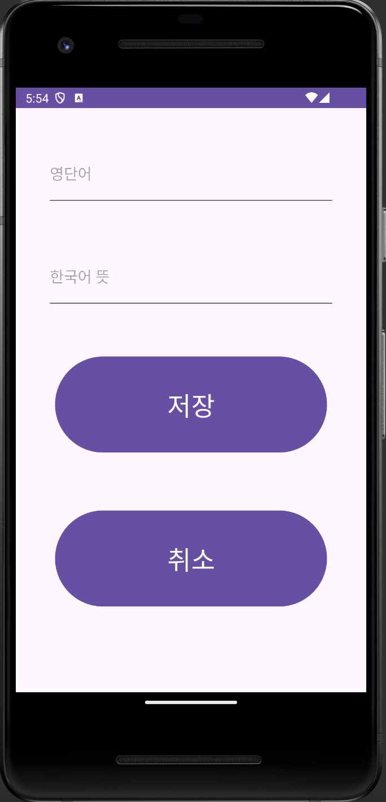
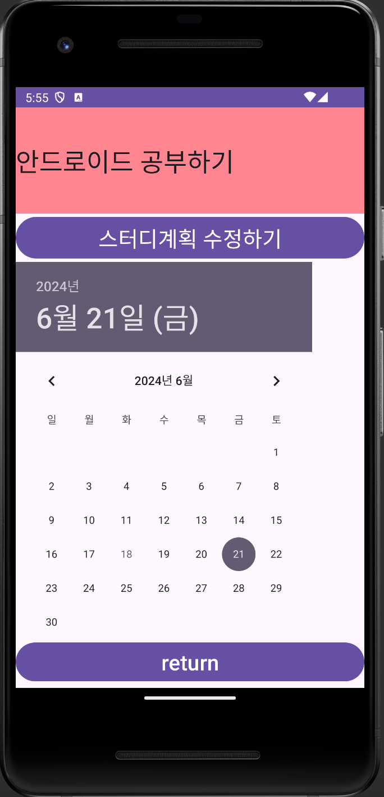

# Final-Project

## 학습 관리 안드로이드 어플리케이션

### 1. 프로젝트에 관하여
  사용자의 학습을 보조해주는 여러 가지 기능을 가지고 있는 안드로이드 어플리케이션이다.
  사용자가 하나의 앱을 통하여 직관적으로 학습 관련 도움을 얻는 것을 목표로 한다.
### 2. 프로젝트 기능
- 영어 단어장 : 영어단어를 저장하고 뜻을 볼 수 있는 기능이다.
- 학습 플래너 : 날짜별로 학습 계획을 세울 수 있는 기능이다.
- 학습 타이머 : 학습 시간을 측정할 수 있는 기능이다.
### 3. 프로젝트 결과
- 메인 화면   
- 영어 단어장     
- 학습 플래너   
- 학습 타이머   
### 4. 기대 효과
- 사용자는 영어 단어장 기능을 이용하여 짜투리 시간에 영어 단어를 외울 수 있고 모르는 단어를 계속해서 추가해 나갈 수 있어서 따로 영어단어장을 가지고 다니는 번거로움을 해소할 수 있을 것이다.
- 사용자는 학습 플래너 기능을 통해 각 날짜별로 공부할 내용을 체계적으로 관리하고 상기할 수 있을 것이다.
- 사용자는 학습 타이머 기능을 이용하여 오늘 얼마나 공부했는지를 측정할 수 있을 것이다.
### 5. 관련 기술
- Java : 자바(Java)는 1995년에 선 마이크로시스템즈(Sun Microsystems)에서 처음 출시한 범용, 객체 지향 프로그래밍 언어이다. 자바는 다양한 플랫폼에서 실행할 수 있도록 설계되었으며, "Write Once, Run Anywhere"라는 슬로건을 통해 플랫폼 독립성을 강조한다. 이는 자바 가상 머신(JVM, Java Virtual Machine)을 통해 이루어진다.
### 6. 개발 도구
- Android Studio : 안드로이드 스튜디오(Android Studio)는 구글이 제공하는 공식 통합 개발 환경(IDE)으로, 안드로이드 운영 체제용 애플리케이션을 개발하는 데 사용된다. IntelliJ IDEA를 기반으로 하며, 안드로이드 앱 개발을 위한 다양한 도구와 기능을 제공한다.
### 7. 발표 영상
  유튜브 동영상

  

